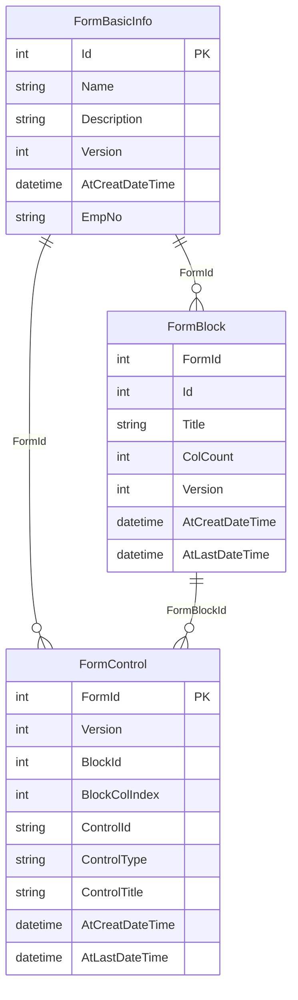

# WFDynamicFormBuilder (DynamicFormFW)

WFDynamicFormBuilder 是一個使用 C# 4.8 WebForms 的動態表單構建器，允許用戶自由設計問題和控制項，類似於 Google 表單。這個專案提供了一個易於使用的介面來創建、管理和渲染可自定義的表單。

## 功能(Features)

- **多種控制項類型**：包括文本框、單選按鈕、複選框、下拉選單等。
- **實時表單預覽**：在構建表單時即時查看預覽。

## 演示(Dome)

## Entity Relationship Diagram

## 開始使用(Getting Started)

### 環境需求(Prerequisites)

- Visual Studio 2019 or later
- .NET Framework 4.8
- Basic knowledge of C# and WebForms
- MSSQL

### 安裝方式(Installation)

需要的資料表位於 DemoData

## 貢獻(Contributing)

Contributions are welcome! Please fork the repository and create a pull request with your changes.

歡迎貢獻！請 fork 這個倉庫並創建 pull request 提交你的更改。